# Full Stack Development 2 - Assignment.

**Name:** Ignas Baranauskas

## Features.

- Trending movies.
- Movie Detail view has actor info.
- An additional data entity type actor.
- My fantasy movie (advanced).
- Favourite movies.
- Favourite actors.
- Movie Search.
- Pagination.
- Basic authentication (fake).
- Private and Public routes.
- Premium functionality.
- Ordered movies/favourites.
- Deployment (vercel).
- Uploading a movie poster

## Feature Design.

#### Trending movies.

> Lists movies from the Trending movies endpoint of TMDB.

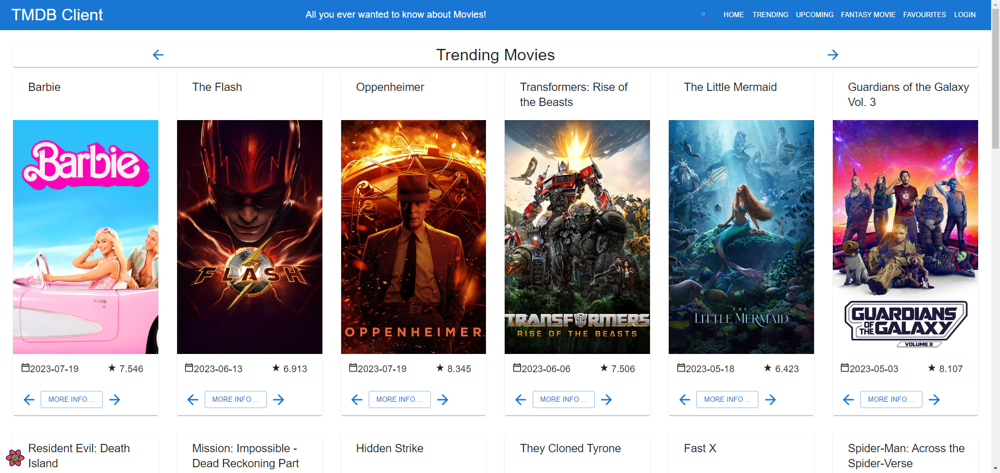

### Movie Detail view has actor info.

> Movies detail view shows actors and if signed it they can be favourited

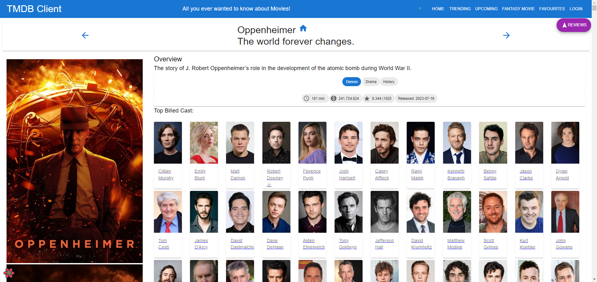

### Entity type actor.

> There is a new entity type actor that every movie have, and can be added to fantasy movie

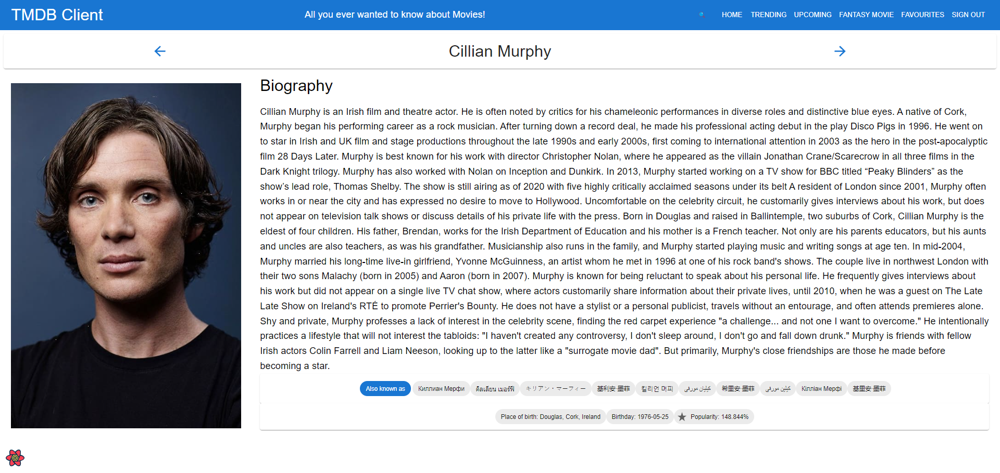

### Fantasy movie.

> User can add a fantasy movie

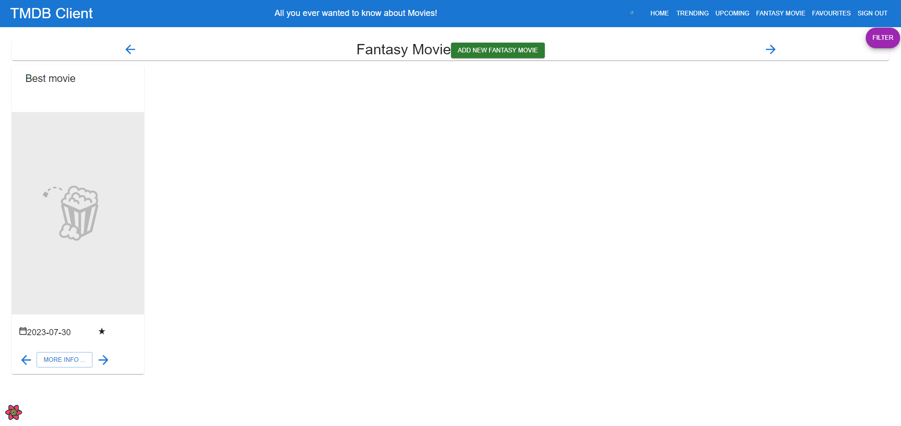

> Fantasy movie form page

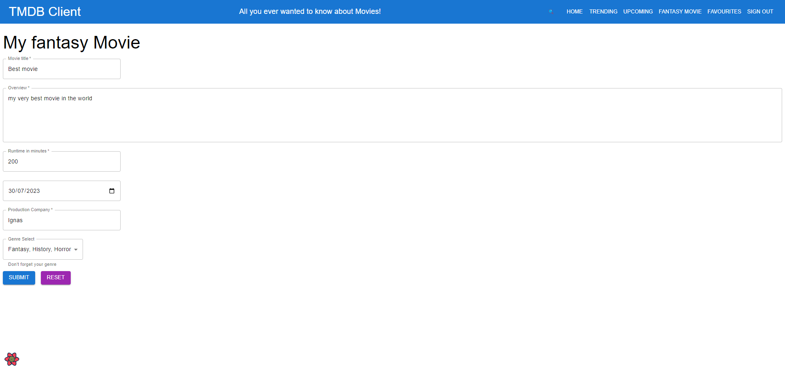

### Fantasy movies.

> Fantasy movie multiple movies with uploaded images

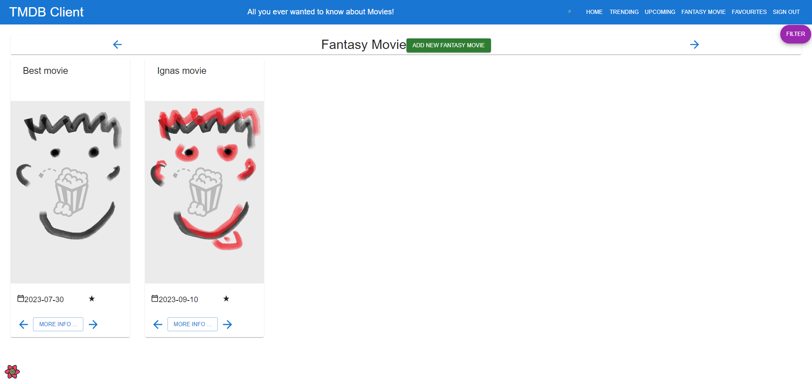

### Favourite actors.

> User can have favourite actors

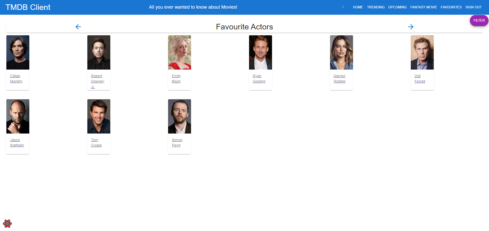

### Movie Search.

> Search form can be used to find a movie

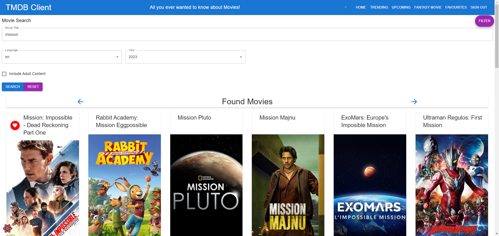

> Search form using different language to find movies

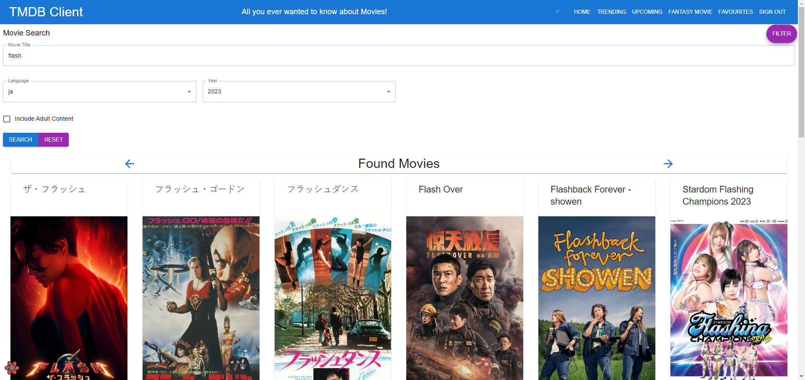

### Pagination.

> Every place with movies has a pagination, uncluding search

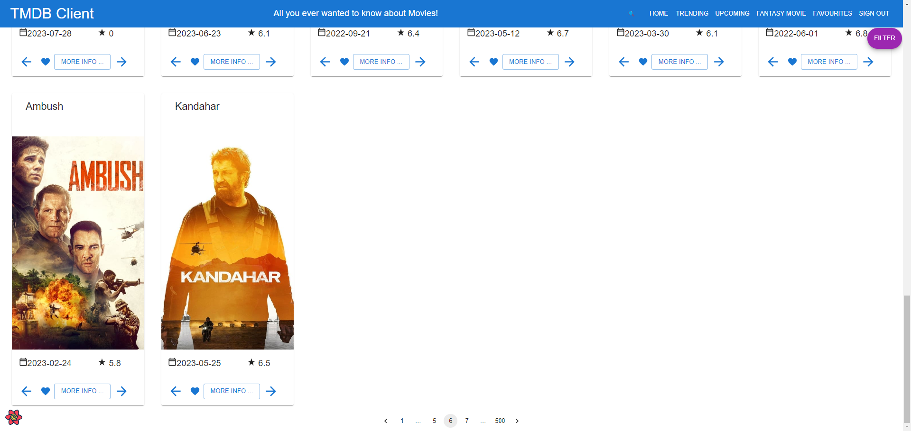

### Basic authentication (fake).

> Not a real authentication but there is protected routes and features until login is pressed.

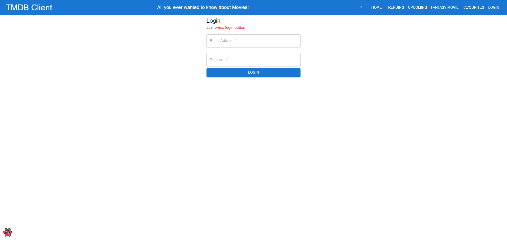

### Private and Public routes

> Actor detail page is private

### Premium functionality.

> Reviews and filtering is private

> Marking a movie or an actor as favourite is private

> Adding fantasy movie is private

### Ordered movies/favourites.

> Every place with a movie allows for it's ordering using arrows

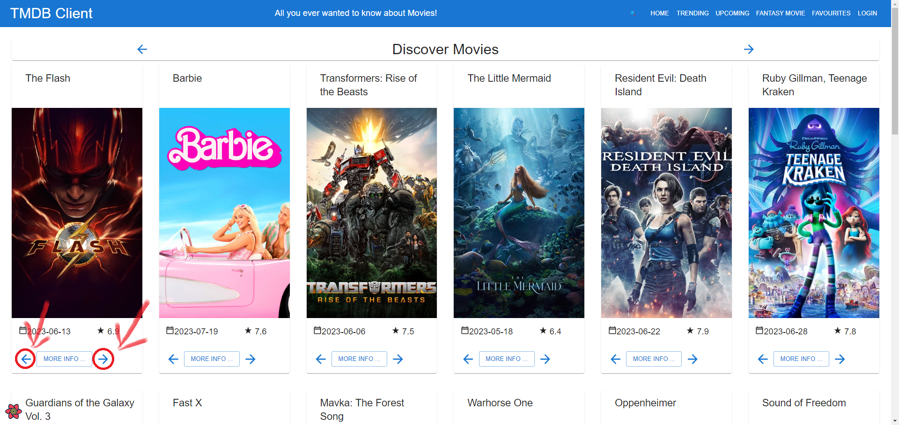

### Deployment (vercel).

> App is deployed to vercel [https://movies-app-73lv.vercel.app/](https://movies-app-73lv.vercel.app/)

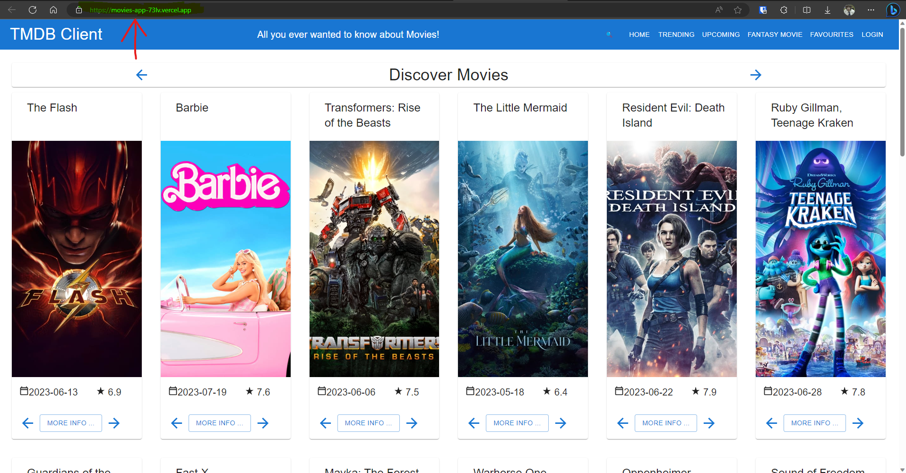

### Uploading a movie poster

> Fantasy movie image upload

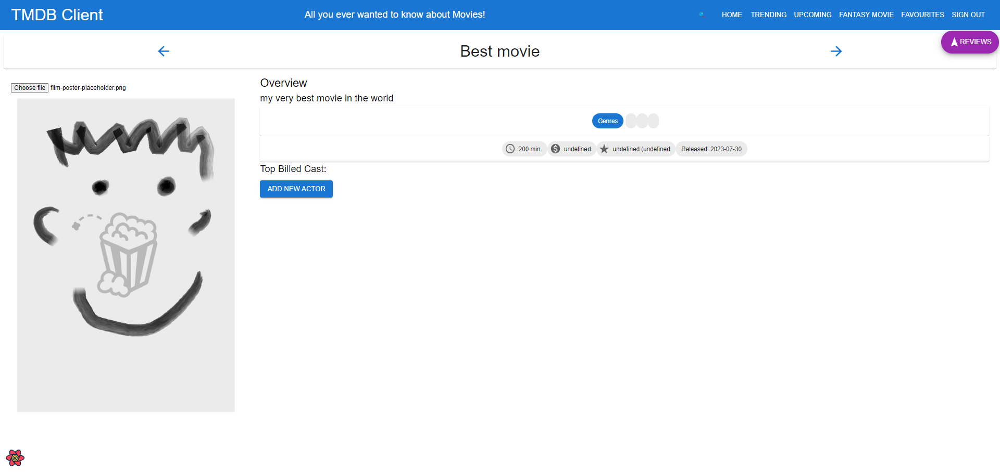

## Storybook.

> Actor Form story

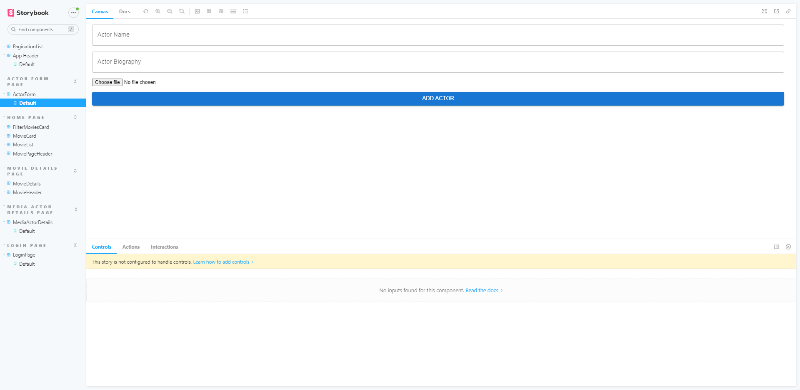

> Login story

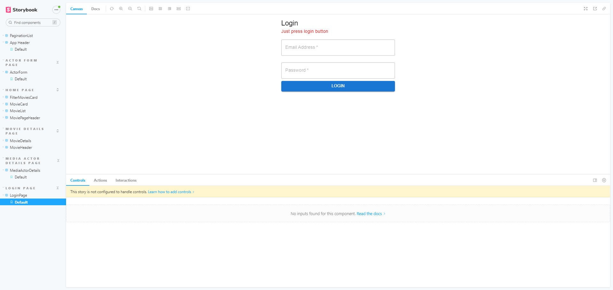

> Movie details have actors story

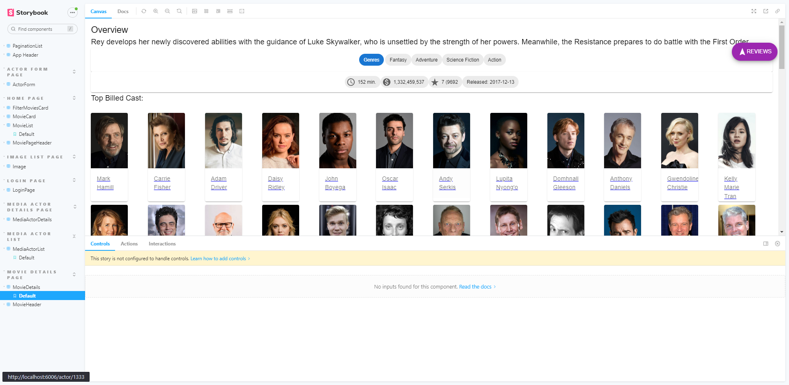

## Authentication. (if relevant)

- Only fake one to have protected routes and features.

#### Protected routes

- /actor/actorID - Actor detail page is private is the only protected route but any could be protected.

#### Protected functionality. (if relevant)

- Only authenticated users can tag a 'movie' as a 'favourite'.
- Only authenticated users can tag a 'actor' as a 'favourite'.
- Only authenticated users can add fantasy movie.
- Only authenticated users can use filtering/sorting funtionality
- Only authenticated users see reviews

## Deployment (if relevant).

> App is deployed to vercel [https://movies-app-73lv.vercel.app/](https://movies-app-73lv.vercel.app/)

> Vercel Dashboard images

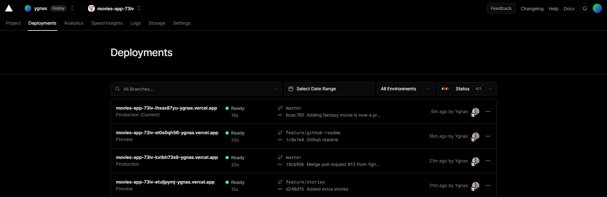
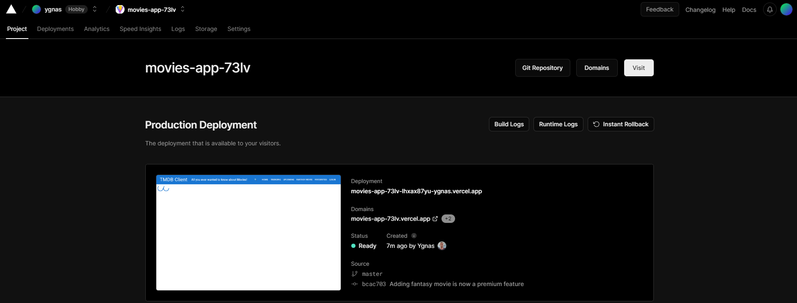

## Additional Information.

> All of the movies use same MovieListPageTemplate to display them

> If movie or Actor is favourite the heart icon to do so again will dissapear

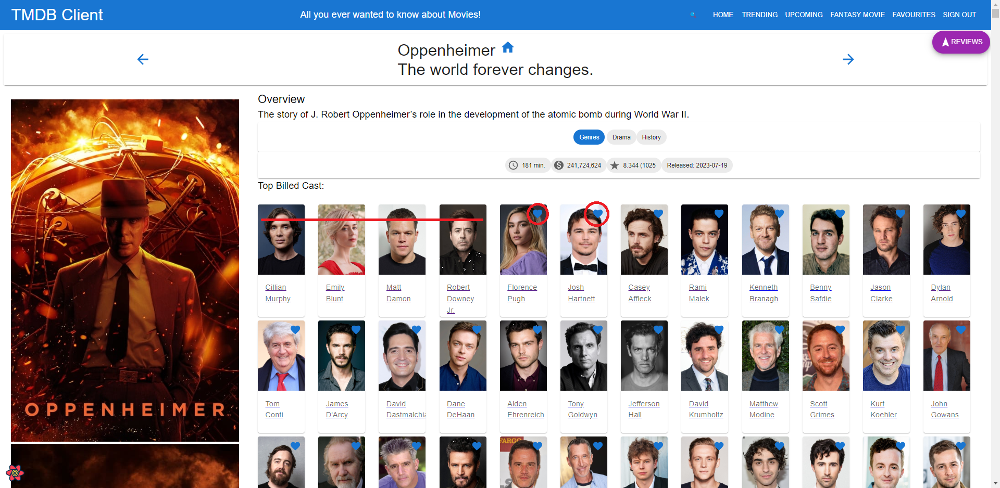

> Movies can be sorted by name

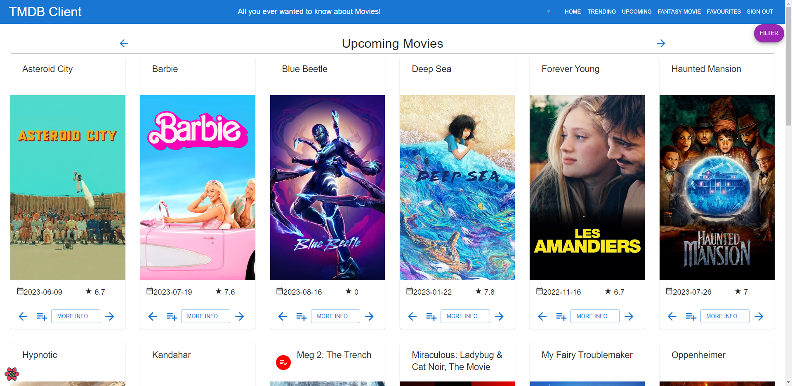
